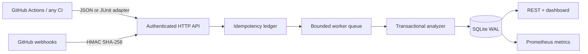

# TriageCI

TriageCI is a self-hosted CI failure-intelligence service. It ingests language-agnostic test results, builds an audit trail for every test, separates consistently failing regressions from nondeterministic failures, and clusters repeated stack traces into actionable incidents.

It is a real GitHub Actions integration rather than a synthetic dashboard: CI can upload normalized JSON directly or convert JUnit XML with the included adapter. The service acknowledges authenticated reports quickly, processes them through a bounded background queue, and exposes repository health through a REST API, a live dashboard, and Prometheus metrics.

## Why this exists

One red test can represent a product regression, an unreliable test, or infrastructure noise. Blind retries make the build green but erase evidence. TriageCI preserves the history and makes its classification explainable: pass/fail counts, transitions, same-commit reruns, failure signatures, and sample confidence are all visible.

## Architecture



## Engineering highlights

- HMAC-SHA256 GitHub webhook verification and constant-time API-token checks
- content-bound idempotency keys that survive restarts and reject conflicting replays
- bounded admission queue with `429` backpressure instead of unbounded memory growth
- transactional run ingestion and materialized test statistics in SQLite WAL mode
- language-agnostic test schema plus a safe standard-library JUnit XML adapter
- explainable flaky/regression state machine with same-commit, transition, and failure-streak evidence
- normalized failure-signature clustering for paths, line numbers, UUIDs, and durations
- health endpoints, Prometheus-format metrics, graceful shutdown, OpenAPI contract, and hardened container defaults
- dependency-free TypeScript runtime on Node.js 24, tested with Node's built-in test runner

## Quick start

Requirements: Node.js 24+.

```bash
export TRIAGECI_TOKEN='replace-me'
export GITHUB_WEBHOOK_SECRET='replace-me-too'
npm start
```

Open `http://localhost:8080`, then upload a report:

```bash
curl -X POST http://localhost:8080/api/v1/runs \
  -H 'Content-Type: application/json' \
  -H 'X-TriageCI-Token: replace-me' \
  -H 'Idempotency-Key: github-run-123-attempt-1' \
  --data @report.json
```

To populate the dashboard with stable, flaky, and regression histories locally, run `npm run demo:seed` in a second terminal.

The accepted report shape is:

```json
{
  "repository": "owner/repository",
  "runId": "123",
  "attempt": 1,
  "commitSha": "abcdef1234567",
  "branch": "main",
  "tests": [
    { "suite": "checkout", "name": "charges card", "status": "failed", "durationMs": 912, "failure": "timeout ..." }
  ]
}
```

For JUnit output:

```bash
python scripts/junit_to_json.py test-results.xml \
  --repository "$GITHUB_REPOSITORY" --run-id "$GITHUB_RUN_ID" \
  --attempt "$GITHUB_RUN_ATTEMPT" --commit "$GITHUB_SHA" --branch "$GITHUB_REF_NAME" \
  > triageci-report.json
```

## Verification

```bash
npm test
npm run stress
```

The stress test sends concurrent reports, waits for durable processing, replays the first 100 delivery IDs, verifies unauthorized traffic is rejected, and writes its exact workload and latency distribution to `benchmark-results.json`.

The documented three-run campaign processed **375,000 test observations with zero processing failures**, correctly detected all seeded flaky tests and regressions, and sustained a median **12,261 observations/second**. See [BENCHMARK.md](docs/BENCHMARK.md) for the complete workload, environment, run-level results, and measurement boundaries.

## Scope and limitations

This release is intentionally single-node. SQLite and the in-process queue make it easy to run and inspect, but queued jobs are not leased across a crash. The delivery ledger exposes incomplete work instead of silently losing it. A horizontally scaled deployment should use a durable broker and a partitioned database. TriageCI reports evidence and recommendations; it does not automatically quarantine a test or override a CI result.

See [DESIGN.md](docs/DESIGN.md), [SECURITY.md](SECURITY.md), and [openapi.yaml](openapi.yaml) for the engineering rationale and interfaces.
