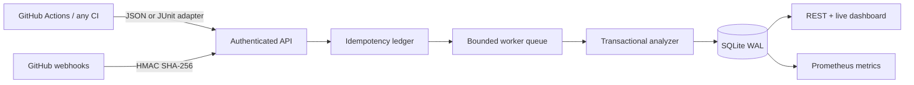

<div align="center">

# TriageCI

**Turn noisy CI failures into explainable flaky-test and regression signals.**

[](https://github.com/EesherJ39/TriageCI/actions/workflows/ci.yml)
[](src/)
[](src/database.ts)
[](docs/BENCHMARK.md)
[](https://eesherj.com/projects/triageci)

</div>

TriageCI is a self-hosted failure-intelligence service for engineering teams. It ingests language-agnostic test results, preserves an audit trail for every test, separates nondeterministic failures from sustained regressions, and groups repeated stack traces into actionable incidents.

Unlike a synthetic dashboard, TriageCI is designed to sit in a real CI path: GitHub Actions can send normalized JSON directly or convert JUnit XML with the included adapter. Authenticated reports are acknowledged quickly, processed through a bounded queue, and exposed through a REST API, live dashboard, and Prometheus metrics.

## At a glance

| Concern | Implementation |
|---|---|
| Trust boundary | HMAC-SHA256 GitHub webhooks and constant-time API-token checks |
| Duplicate delivery | content-bound idempotency ledger persisted across restarts |
| Load control | bounded admission queue with `429` backpressure |
| Analysis | pass/fail history, transitions, failure streaks, same-commit reruns, sample confidence |
| Incident grouping | normalized stack-trace signatures for paths, line numbers, UUIDs, and durations |
| Persistence | transactional ingestion and materialized statistics in SQLite WAL mode |
| Operations | health endpoints, Prometheus metrics, graceful shutdown, OpenAPI contract |

## Architecture



## Explainable classification

One red test can mean a product regression, a flaky test, or infrastructure noise. Blind retries can make a build green while deleting the evidence needed to tell those cases apart. TriageCI retains the underlying observations and makes every classification inspectable through counts, transitions, same-commit behavior, recent failure streaks, and normalized failure signatures.

The analyzer reports evidence and recommendations; it does not silently quarantine tests or override CI outcomes.

## Reproducible performance evidence

The documented three-run campaign processed **375,000 test observations with zero processing failures**, correctly detected all seeded flaky tests and regressions, and sustained a median **12,261 observations/second**.

| Workload property | Recorded campaign |
|---|---|
| Concurrent clients | 64 |
| Total observations | 375,000 across three runs |
| Duplicate-delivery replay | first 100 delivery IDs |
| Correctness gates | durable completion, expected classifications, rejected unauthorized traffic |
| Median throughput | 12,261 observations/second |

These are local stress-test results, not a production capacity guarantee. [`docs/BENCHMARK.md`](docs/BENCHMARK.md) records the environment, command, distribution, and measurement boundaries.

## Run locally

Requirements: Node.js 24+.

```bash
git clone https://github.com/EesherJ39/TriageCI.git
cd TriageCI
npm ci --ignore-scripts

export TRIAGECI_TOKEN='replace-me'
export GITHUB_WEBHOOK_SECRET='replace-me-too'
npm start
```

Open `http://localhost:8080`. To populate the dashboard with stable, flaky, and regression histories, run this in another terminal:

```bash
npm run demo:seed
```

## Send a test report

```bash
curl -X POST http://localhost:8080/api/v1/runs \
  -H 'Content-Type: application/json' \
  -H 'X-TriageCI-Token: replace-me' \
  -H 'Idempotency-Key: github-run-123-attempt-1' \
  --data @report.json
```

Accepted reports use a CI-independent schema:

```json
{
  "repository": "owner/repository",
  "runId": "123",
  "attempt": 1,
  "commitSha": "abcdef1234567",
  "branch": "main",
  "tests": [
    {
      "suite": "checkout",
      "name": "charges card",
      "status": "failed",
      "durationMs": 912,
      "failure": "timeout while waiting for provider"
    }
  ]
}
```

Convert JUnit XML without adding a parser dependency:

```bash
python scripts/junit_to_json.py test-results.xml \
  --repository "$GITHUB_REPOSITORY" \
  --run-id "$GITHUB_RUN_ID" \
  --attempt "$GITHUB_RUN_ATTEMPT" \
  --commit "$GITHUB_SHA" \
  --branch "$GITHUB_REF_NAME" \
  > triageci-report.json
```

## Verify

```bash
npm test
npm run test:junit
npm run stress
docker build --tag triageci:local .
```

The stress runner writes the exact workload and latency distribution to `benchmark-results.json` so performance claims remain reviewable.

## Repository map

| Path | Responsibility |
|---|---|
| `src/analyzer.ts` | test-history statistics and flaky/regression classification |
| `src/database.ts` | schema, transactions, materialized statistics, and delivery ledger |
| `src/queue.ts` | bounded background processing and backpressure |
| `src/auth.ts` | webhook signatures and token verification |
| `src/dashboard.ts` | zero-build live operational interface |
| `scripts/junit_to_json.py` | safe standard-library JUnit adapter |
| `scripts/stress.mjs` | concurrent ingestion, replay, auth, and latency workload |
| `openapi.yaml` | public HTTP contract |

## Scope and limitations

This release is intentionally single-node. SQLite and an in-process queue make it easy to run and inspect, but queued jobs are not leased across a crash. The delivery ledger exposes incomplete work instead of silently losing it. Horizontal scale would require a durable broker and partitioned database.

See [`docs/DESIGN.md`](docs/DESIGN.md), [`SECURITY.md`](SECURITY.md), and [`openapi.yaml`](openapi.yaml) for the design rationale, security boundary, and complete interface.
